# ShareWise AI - Visual Flow Diagrams

## Mermaid Diagrams for Process Visualization

### 1. User Authentication Flow

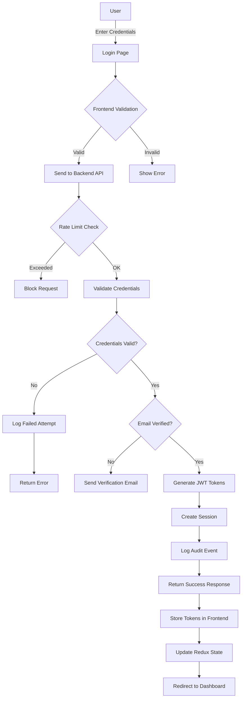

### 2. Trading Signal Generation Flow

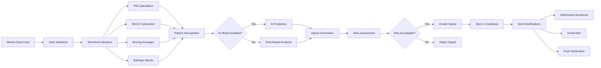

### 3. Order Execution Flow

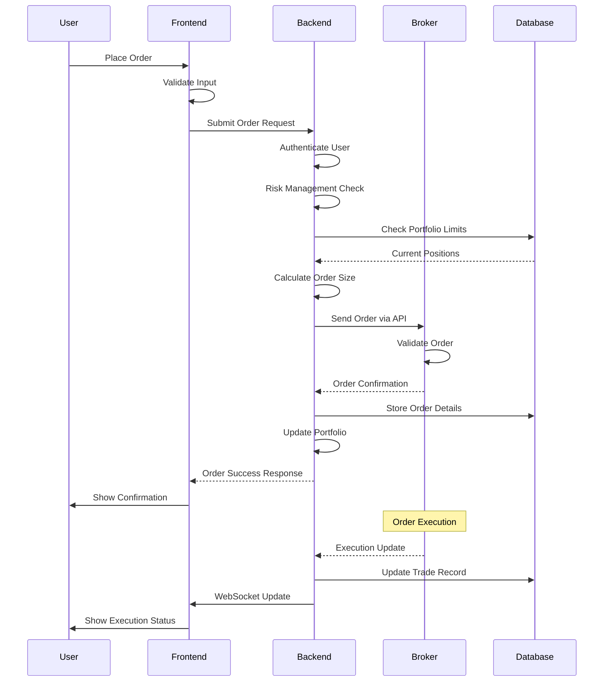

### 4. AI Model Training Pipeline

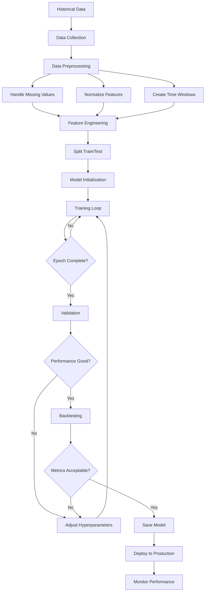

### 5. Role-Based Access Control

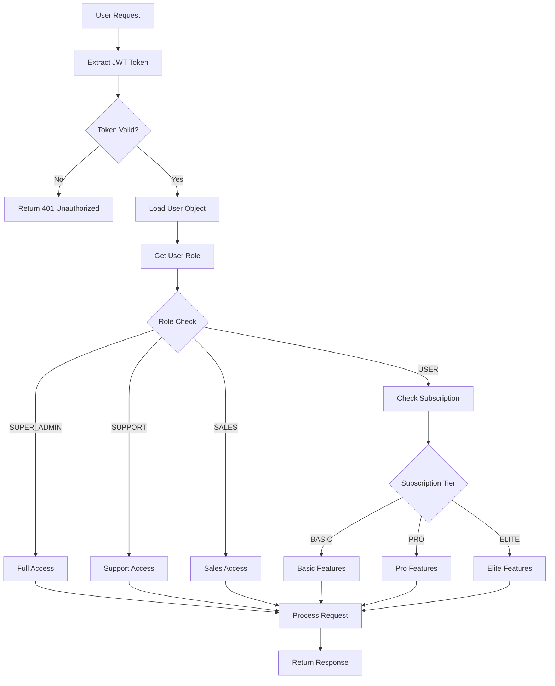

### 6. WebSocket Real-time Communication

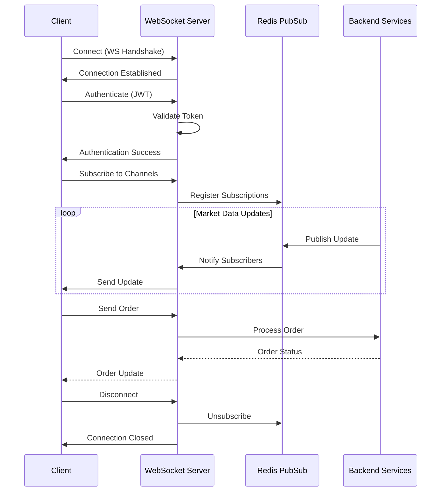

### 7. Broker Integration OAuth Flow

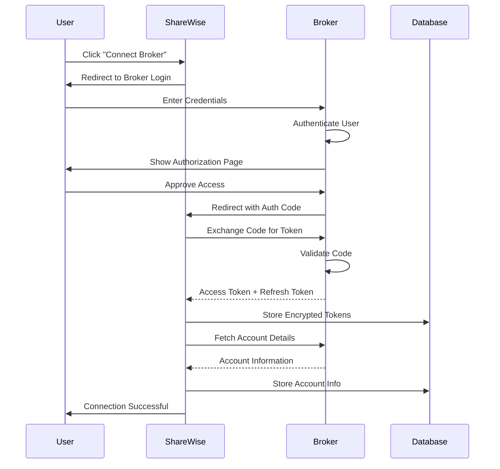

### 8. Portfolio Management State Machine

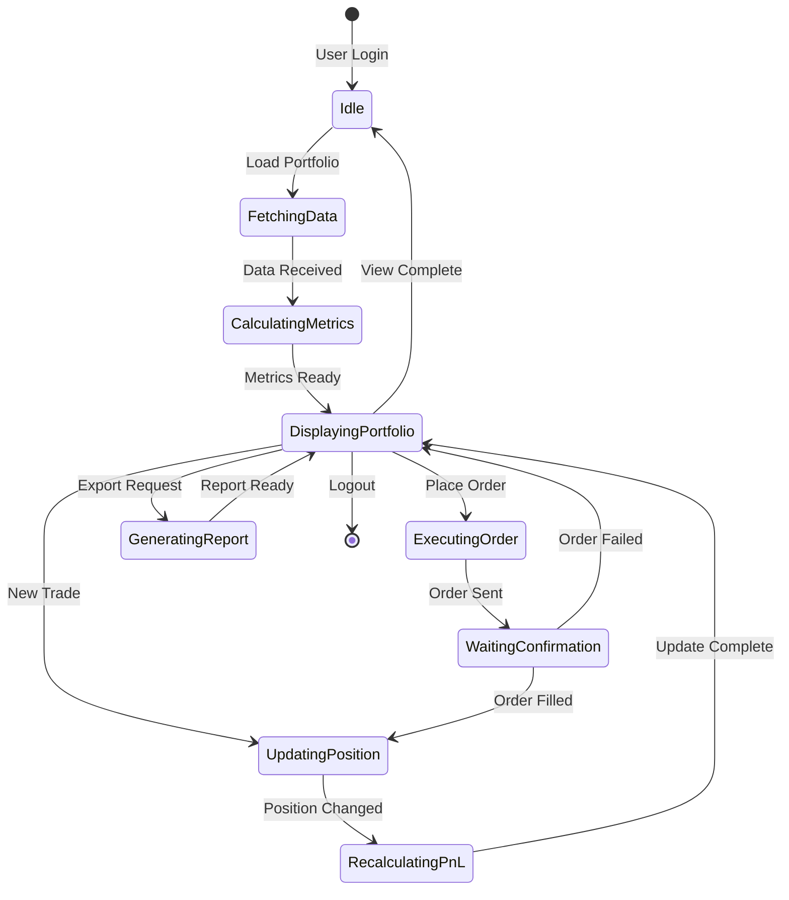

### 9. Subscription Lifecycle

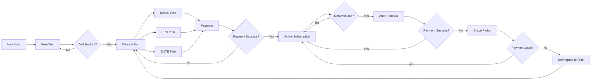

### 10. Error Handling and Recovery

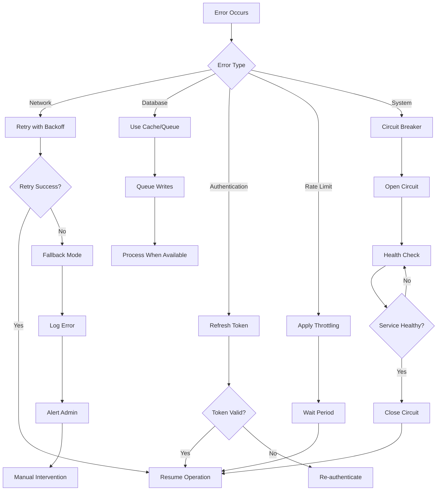

### 11. Data Flow Architecture

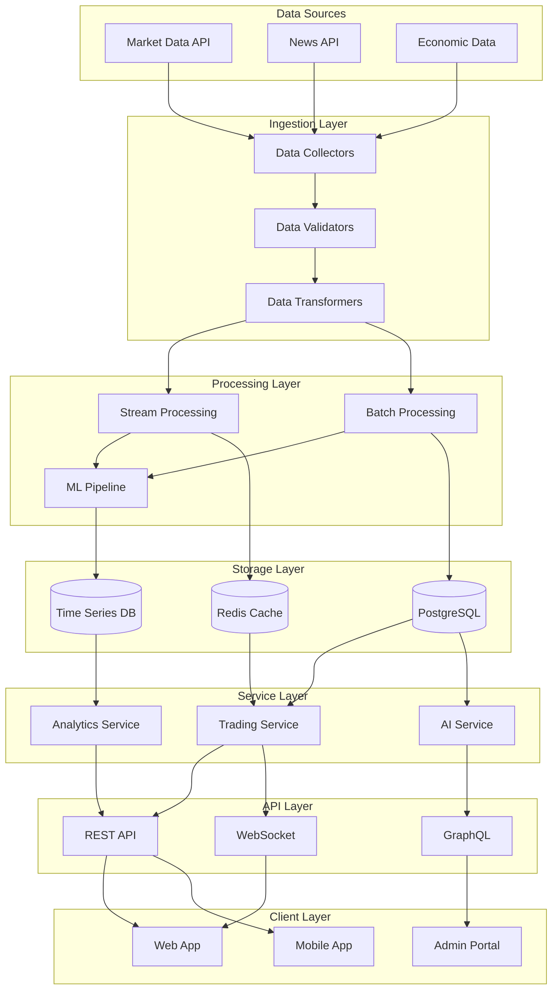

### 12. Microservices Communication

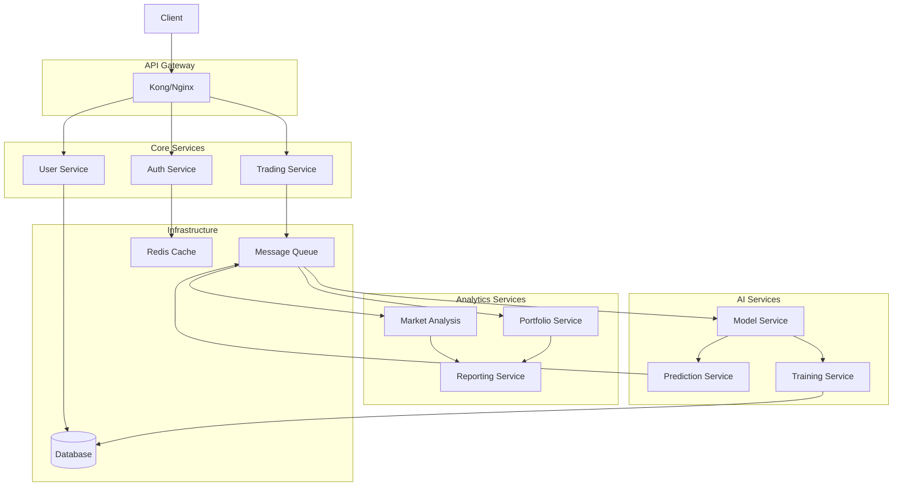

### 13. CI/CD Pipeline

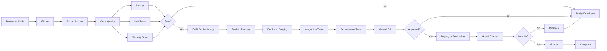

### 14. Database Schema Relationships

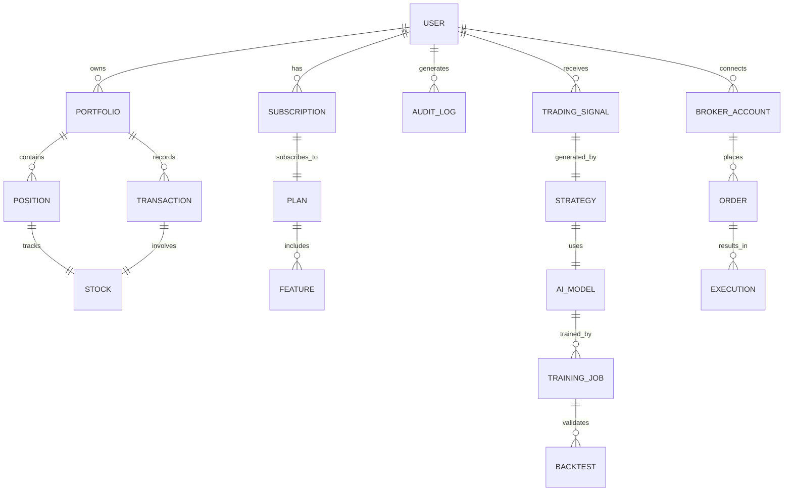

### 15. Security Layer Flow

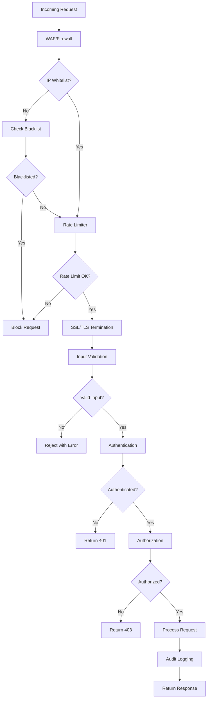

---

## How to Read These Diagrams

### Diagram Types Used:

1. **Flow Charts (graph TD/LR)**: Show the flow of processes from start to end
2. **Sequence Diagrams**: Show interactions between different components over time
3. **State Diagrams**: Show different states and transitions in a system
4. **ER Diagrams**: Show database relationships between entities

### Symbol Meanings:

- **Rectangles**: Process or action steps
- **Diamonds**: Decision points
- **Circles**: Start/End points
- **Arrows**: Flow direction
- **Parallel lines**: Parallel processes

### Color Coding (when rendered):

- **Green**: Success paths
- **Red**: Error paths
- **Blue**: Normal processes
- **Yellow**: Warning or caution states

---

## Using These Diagrams

### For Developers:
- Use these diagrams to understand system flow
- Reference during implementation
- Update when making changes

### For Product Managers:
- Understand feature workflows
- Identify optimization opportunities
- Plan new features

### For QA Teams:
- Design test cases
- Understand edge cases
- Verify system behavior

### For Support Teams:
- Troubleshoot issues
- Understand user journeys
- Provide better assistance

---

*Note: These diagrams can be rendered using any Mermaid-compatible viewer or documentation tool.*

*Last Updated: August 2025*
*Version: 1.0.0*